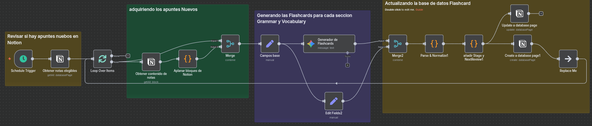
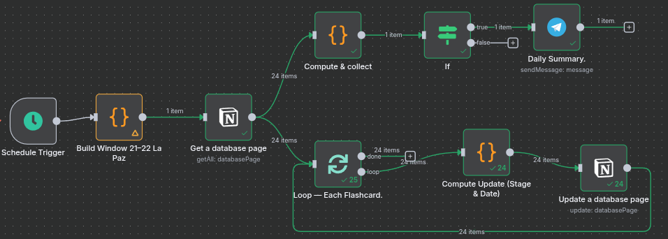
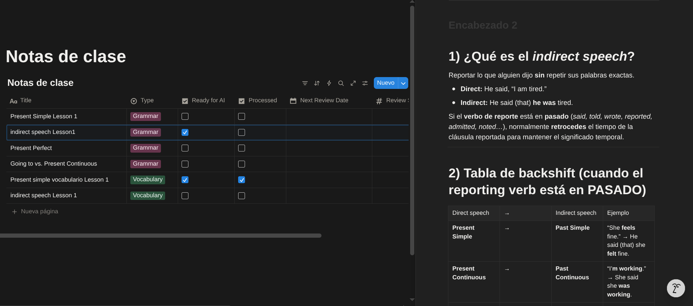
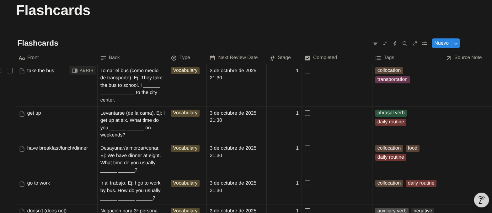

# Automate your learning: de Notion a Flashcards con IA + recordatorios SRS en Telegram (n8n)

> **Diseñado para tomar apuntes de *inglés* de los cursos de Platzi (o de otras fuentes)** y convertirlos en flashcards con repaso espaciado. *También es adaptable a cualquier otra materia.*

---

## ✨ TL;DR
Con estos **2 flujos en n8n**:
1) **Generador de Flashcards Notion**: toma tus apuntes en Notion (enfocado en **inglés** de Platzi u otras fuentes; *Grammar/Vocabulary*), los normaliza y crea **flashcards** automáticamente con ayuda de IA.



2) **Recordatorios Telegram (SRS)**: cada noche busca las flashcards que tocan, **actualiza el Stage** y te envía **UN solo mensaje** por Telegram con el resumen del día (aprendizaje espaciado: 3/7/14 días).


---

## 🎯 Problema que resuelve
Estudiar con apuntes largos dispersos (por ejemplo, de **cursos de inglés en Platzi**) y olvidarse de repasar a tiempo. Convertir todo en flashcards y mantener una rutina de repasos (spaced repetition) **a mano** es tedioso y fácil de abandonar.

---

## ✅ ¿Cómo lo resuelve?
- **De apuntes a tarjetas, sin fricción**: Leo tus notas en Notion (por tipo *Grammar* o *Vocabulary* de **inglés**, provenientes de Platzi u otras fuentes), limpio/estandarizo el contenido y genero **flashcards** bien formadas (Front/Back/Type/Tags).
- **Sistema de repaso inteligente (SRS)**: Cada día a las **21:00 (America/La_Paz)** selecciono solo las tarjetas “que tocan hoy”, **actualizo Stage y Next Review Date** (0→1: +3 días, 1→2: +7, 2→3: +14; Stage 3 se marca Completed) y envío **un único mensaje** a Telegram con la **cantidad por tipo** (p. ej., “14 Vocabulary y 5 Grammar”).
- **Reutilizable y adaptable**: Aunque está pensado para **inglés**, solo cambias **IDs de Notion** y **chatId de Telegram** para usarlo con cualquier otra asignatura (programación, medicina, leyes, etc.).

---

## 🧩 Arquitectura (visión general)

```
[Notion: Notas] --(IA + normalización)--> [n8n: Generador]
      \_____________________________________________/
                       | crea
                       v
                [Notion: Flashcards]
                       |
     Cron diario 21:00 |  Ventana 21:00–22:00, filtro por fecha + Completed=false
                       v
               [n8n: Recordatorios]
                       |
          resumen por Type + total (UN mensaje)
                       v
                  [Telegram]
```

---

## 🗄️ Estructura de bases en Notion

### DB: **Notas**
| Campo | Tipo | Descripción |
|---|---|---|
| **Title** | Title | Título de la nota o clase |
| **Type** | Select (`Grammar`, `Vocabulary`) | Clasificación del contenido (enfocado en inglés) |
| **Ready for AI** | Checkbox | Marca si la nota está lista para generar flashcards |
| **Processed** | Checkbox | Se marca en `true` cuando ya generaste flashcards de esta nota |
| **Content** | Rich Text/Body | El contenido de la nota (puede ser texto con ejemplos) |



### DB: **Flashcards**
| Campo | Tipo | Descripción |
|---|---|---|
| **Front** | Title | Cara frontal de la tarjeta |
| **Back** | Rich Text | Respuesta/definición/ejemplo |
| **Type** | Select (`Grammar`, `Vocabulary`) | Para agrupar en el resumen |
| **Stage** | Number (0–3) | Etapa del SRS |
| **Next Review Date** | Date (con hora) | Próxima revisión (se respeta zona horaria) |
| **Completed** | Checkbox | Se marca `true` al llegar a Stage 3 |
| **Tags** | Multi-select | Palabras clave opcionales |



---

## 🛠️ Requisitos
- Cuenta Notion + 2 bases (IDs).
- Bot de **Telegram** (token) + **chatId**.
- **n8n v1.103.2** (o compatible).
- Apuntes de **inglés** (Platzi u otras fuentes) guardados en la DB **Notas**.
- (Opcional) Acceso a un modelo IA (p. ej., Gemini) si usas prompts de generación.

---

## ⚙️ Variables y parámetros a personalizar

Agrega estas referencias en tus nodos o como variables en n8n (según tu preferencia):

```bash
# IDs de bases Notion
NOTION_NOTES_DB_ID="xxxxxxxxxxxxxxxxxxxxx"
NOTION_FLASHCARDS_DB_ID="yyyyyyyyyyyyyyyyy"

# Credenciales (nombres en n8n)
NOTION_CREDENTIAL="MiNotion"
GEMINI_CREDENTIAL="MyGemini"     # o usa API Key según tu configuración
TELEGRAM_CREDENTIAL="MyTelegramBot"

# Telegram
TELEGRAM_CHAT_ID="123456789"       # Usuario
# o
TELEGRAM_CHAT_ID="-100xxxxxxxxxx"  # Grupo

# Zona horaria
TIMEZONE="America/La_Paz"

# Horario del cron (Recordatorios)
CRON_HOUR="21"     # 24h
CRON_MINUTE="00"
```
---

## 🚀 Implementación (paso a paso)
1. Crea/duplica las dos DBs en Notion (**Notas** y **Flashcards**) y copia sus **IDs**.
2. Importa ambos **JSON** a n8n: **Generador** y **Recordatorios**.
3. Configura credenciales de **Notion** y **Telegram** en n8n.
4. En cada flujo, coloca tus **databaseId** y **chatId** en los nodos indicados.
5. Ejecuta **Generador de Flashcards Notion** con 1 nota de prueba → deberían crearse tarjetas en **Flashcards** con `Stage=0`, `Completed=false` y `Next Review Date`.
6. Ejecuta **Recordatorios Telegram** → debe filtrar las tarjetas “de hoy” (21:00–22:00), actualizar Stage/fechas y enviarte **UN** mensaje resumen a Telegram.
7. **Activa** los flujos; especialmente el **Cron** en el recordatorio.

**Tip — Evitar duplicados:** antes de crear una flashcard nueva, agrega un paso que busque por `Front + Type`. Si existe, **no crees otra**.

---

## 🔁 Lógica SRS (Stages)
- **Stage 0 → 1**: `Next Review Date += 3 días`
- **Stage 1 → 2**: `Next Review Date += 7 días`
- **Stage 2 → 3**: `Next Review Date += 14 días`
- **Stage 3**: Se mantiene en 3 y se marca **Completed = true**

> Se respeta hora y zona horaria. En updates de Notion uso `"time_zone": "America/La_Paz"` para evitar offsets inesperados.

---

## 📎 Enlaces públicos a los JSON (reemplaza con los tuyos)
- **Generador de Flashcards Notion (JSON):**  
  `https://<tu_enlace_publico>/generador-flashcards-notion.json`
- **Recordatorios Telegram (SRS) (JSON):**  
  `https://<tu_enlace_publico>/recordatorios-telegram-srs.json`

---

## 💚 ¿Te fue útil?
Si esto te ayuda a estudiar o a enseñar, **¡apóyame con tu voto en la clase!**  
¿Lo adaptaste a otra materia? **Cuéntame cómo lo reutilizaste** 🙌
